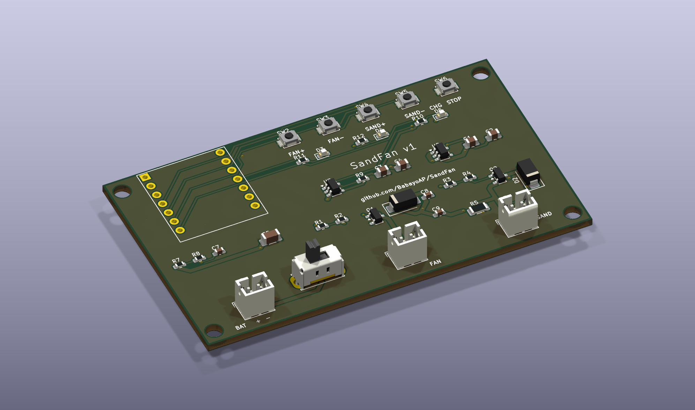
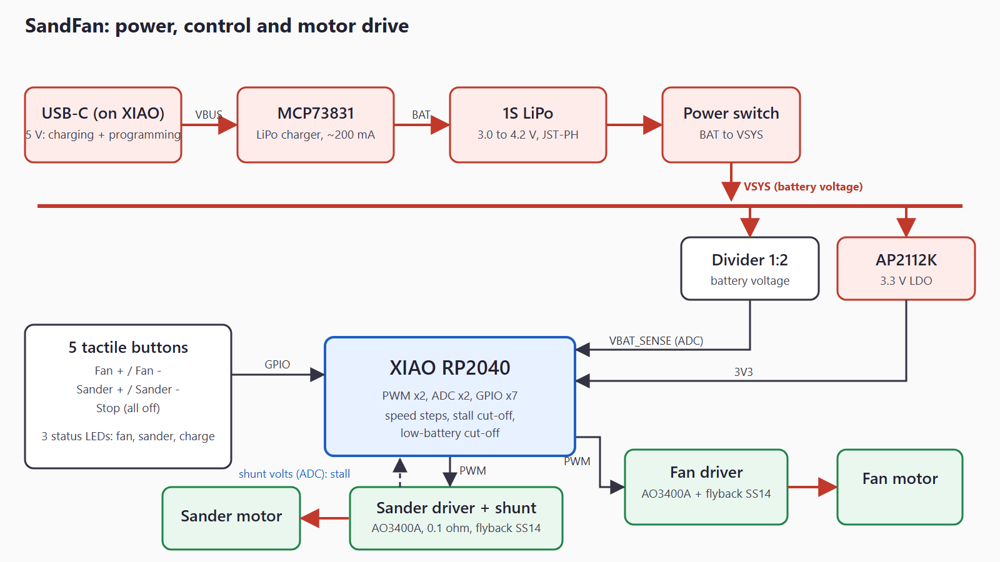
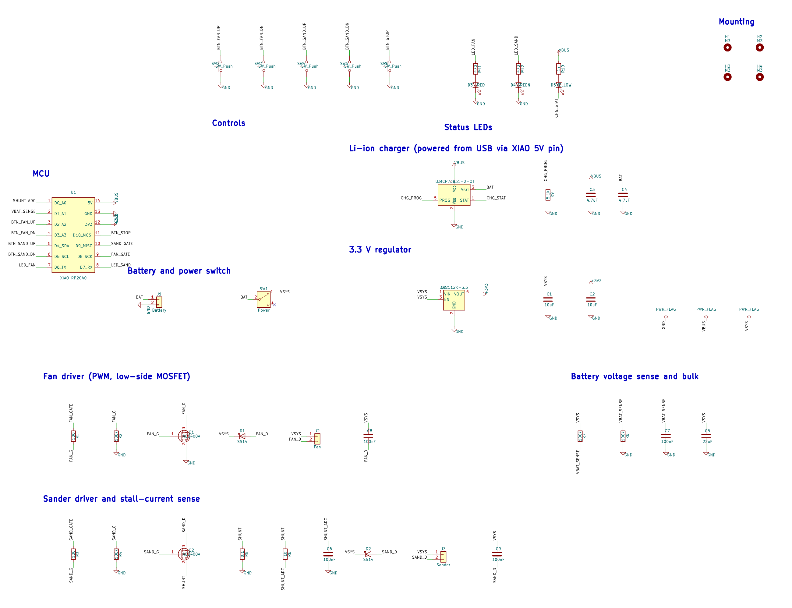
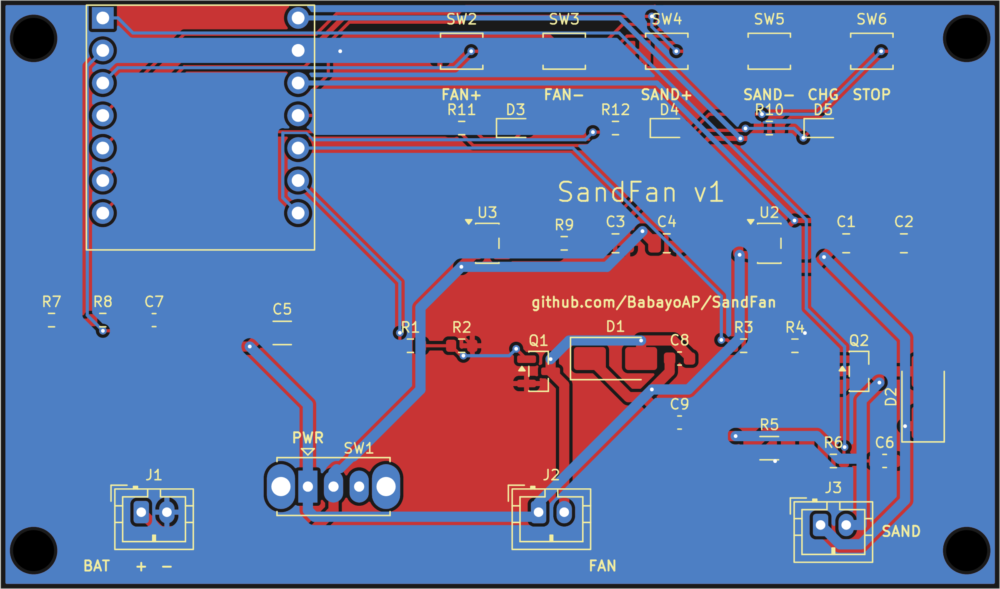
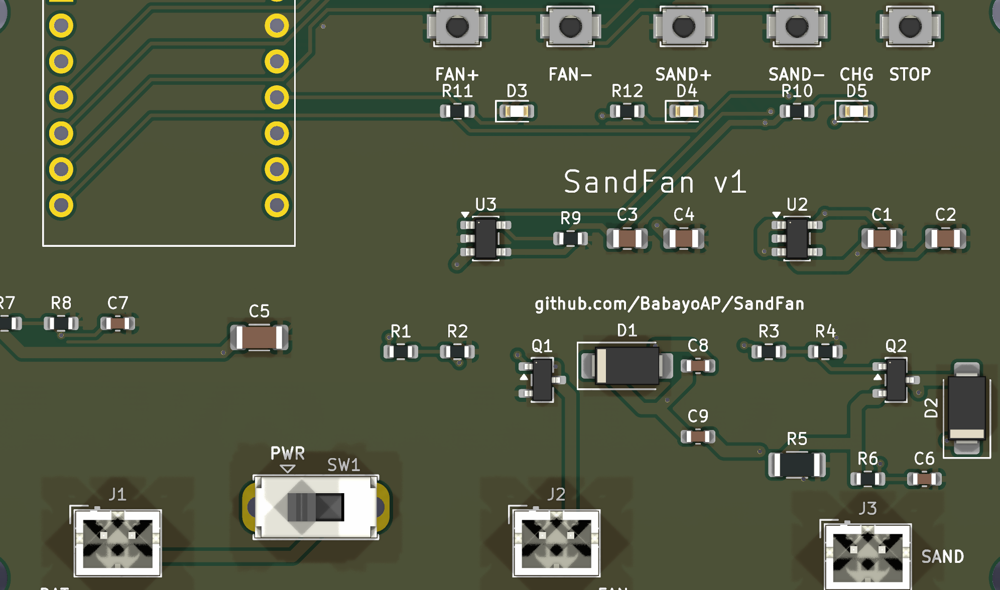

# SandFan

My project for Half-Life by Hack Club!

Meant for climbers, a two-in-one portable device:
 - Variable speed enclosed fan for drying out wet hands on one side.
 - Variable speed skin-sander for grinding down overgrown calluses.

## How it works
[Explain how power, microcontroller, motor/fan drive, stall protection, and buttons connect.]

## Schematic and board

## Wiring
[Only if anything is hand-wired: motor, fan, battery connectors.]

## Bill of materials
| Part | Qty | Price | Link |
|------|-----|-------|------|
|      |     |       |      |

## Repo layout
- hardware/ : KiCad files, Gerbers zip
- firmware/ : source code
- docs/ : images
- bom.csv

## Status and next steps
[What works, what's untested, what changes in build week.]
